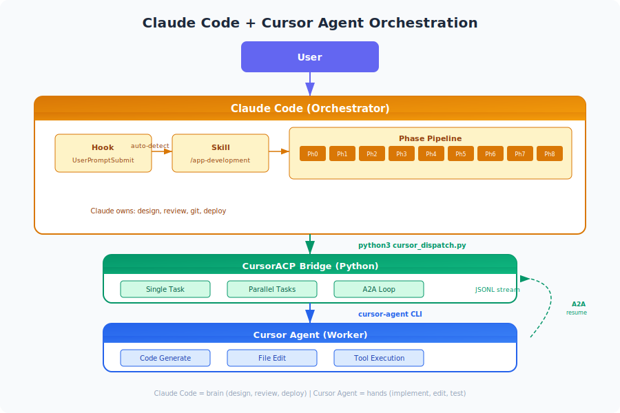

# Claude Code + Cursor Agent Orchestration (CursorACP)

**Claude Code をオーケストレーター、Cursor Agent を実装ワーカーとして連携させるエージェントオーケストレーションシステム**

<p align="center">
  
</p>

## TL;DR

- Claude Code（Anthropic CLI）が **設計・レビュー・デプロイ判断** を担当
- Cursor Agent（Cursor CLI）が **コード実装・テスト・ファイル編集** を担当
- Python ブリッジ (`cursor_dispatch.py`) が両者を繋ぎ、並列実行・A2A対話・セッション管理を提供
- Claude Code の Hook 機構でコーディングタスクを **自動的に** Cursor Agent に委譲

---

## 目次

- [なぜこの構成なのか](#なぜこの構成なのか)
- [アーキテクチャ](#アーキテクチャ)
- [セットアップ](#セットアップ)
- [パイプライン（Phase 0-8）](#パイプラインphase-0-8)
- [CursorACP ブリッジの3つのモード](#cursoracp-ブリッジの3つのモード)
- [自動委譲の仕組み（Hook）](#自動委譲の仕組みhook)
- [メリット・デメリット](#メリットデメリット)
- [ファイル構成](#ファイル構成)
- [使い方の例](#使い方の例)
- [License](#license)

---

## なぜこの構成なのか

AI コーディングエージェントは単体でも強力ですが、**得意分野が異なります**：

| 能力 | Claude Code | Cursor Agent |
|------|-------------|--------------|
| 長文コンテキスト理解・設計 | ★★★★★ | ★★★ |
| コードレビュー・品質判断 | ★★★★★ | ★★★ |
| ファイル編集・リファクタリング | ★★★ | ★★★★★ |
| IDE統合・LSP連携 | ★★ | ★★★★★ |
| GCP/インフラ操作 | ★★★★ | ★★ |
| 並列タスク実行 | ★★★★ | ★★★★★ |

**一つのエージェントにすべてを任せる** のではなく、**それぞれの強みを活かして協調** させることで、より高品質なアウトプットを高速に得られます。

---

## アーキテクチャ

```
┌─────────────────────────────────────────────────────┐
│                    ユーザー                           │
│              「認証機能を作って」                       │
└──────────────────────┬──────────────────────────────┘
                       │
                       ▼
┌─────────────────────────────────────────────────────┐
│              Claude Code (Orchestrator)               │
│                                                       │
│  ┌─────────┐  ┌──────────┐  ┌─────────────────────┐ │
│  │ Hook    │→│ Skill     │→│ Phase Pipeline       │ │
│  │ (auto   │  │ (/app-   │  │ 0: Conception       │ │
│  │ detect) │  │ develop- │  │ 1: Design + Review  │ │
│  │         │  │ ment)    │  │ 2: Implementation   │ │
│  └─────────┘  └──────────┘  │ 3: Integration      │ │
│                              │ 4: Quality Review   │ │
│                              │ 5: Fixes            │ │
│                              │ 6: E2E Testing      │ │
│                              │ 7: GCP Deploy       │ │
│                              │ 8: PR               │ │
│                              └────────┬────────────┘ │
└───────────────────────────────────────┼──────────────┘
                                        │
                    python3 cursor_dispatch.py
                                        │
                                        ▼
┌─────────────────────────────────────────────────────┐
│              CursorACP Bridge (Python)                │
│                                                       │
│  ┌──────────┐  ┌──────────┐  ┌──────────────────┐   │
│  │ Single   │  │ Parallel │  │ A2A Bidirectional│   │
│  │ Task     │  │ Tasks    │  │ Loop             │   │
│  └─────┬────┘  └────┬─────┘  └────────┬─────────┘   │
│        │             │                 │              │
│        └─────────────┼─────────────────┘              │
│                      │                                │
│              cursor-agent CLI                         │
│              (JSONL stream)                            │
└──────────────────────┼────────────────────────────────┘
                       │
                       ▼
┌─────────────────────────────────────────────────────┐
│              Cursor Agent (Worker)                     │
│                                                       │
│  ┌──────────┐  ┌──────────┐  ┌──────────────────┐   │
│  │ Code     │  │ File     │  │ Tool             │   │
│  │ Generate │  │ Edit     │  │ Execution        │   │
│  └──────────┘  └──────────┘  └──────────────────┘   │
└─────────────────────────────────────────────────────┘
```

---

## セットアップ

### 前提条件

- [Claude Code](https://docs.anthropic.com/en/docs/claude-code) (CLI) がインストール済み
- [Cursor](https://cursor.sh/) がインストール済み（有料プラン）
- `cursor-agent` CLI（Cursor 公式 CLI / [ACP](https://agentcommunicationprotocol.dev/) 対応）
- Python 3.10+

### 0. cursor-agent CLI のインストール

```bash
# Cursor 公式インストーラー
curl https://cursor.com/install -fsSL | bash

# ログイン（Cursor アカウントで認証）
cursor-agent login

# 動作確認
cursor-agent status
```

> `~/.local/bin/cursor-agent` にインストールされます。詳細: [Cursor CLI Docs](https://cursor.com/docs/cli/installation)

### 1. CursorACP ブリッジを配置

```bash
git clone https://github.com/bunta-ishiwata/claude-cursor-orchestration.git
cd claude-cursor-orchestration
```

### 2. Claude Code の Hook を設定

`~/.claude/settings.json` に以下を追加：

```json
{
  "hooks": {
    "UserPromptSubmit": [
      {
        "hooks": [
          {
            "type": "command",
            "command": "/path/to/hooks/cursor-delegate.sh"
          }
        ]
      }
    ]
  }
}
```

### 3. Hook スクリプトを配置

```bash
#!/bin/bash
# cursor-delegate.sh
# cursor-agent CLI が存在する場合のみ委譲指示を注入

CURSOR_BIN="${HOME}/.local/bin/cursor-agent"
if [ ! -x "$CURSOR_BIN" ]; then
  exit 0
fi

cat <<'EOF'
{
  "hookSpecificOutput": {
    "hookEventName": "UserPromptSubmit",
    "additionalContext": "CURSOR AGENT DELEGATION ACTIVE: When this task involves writing, editing, or generating code, you MUST use the /app-development skill to orchestrate the full development flow. This skill dispatches coding work to Cursor Agent via CursorACP."
  }
}
EOF
```

### 4. App Development スキルを配置

`~/.claude/commands/app-development.md` にスキル定義を配置します（[例](docs/skill-example.md)）。

---

## パイプライン（Phase 0-8）

開発タスクが委譲されると、以下のフェーズを順に実行します：

| Phase | 担当 | 内容 | モデル |
|-------|------|------|--------|
| **0. Conception** | Claude Code | 要件整理・ヒアリング | Claude Opus |
| **1. Design + Review** | Claude Code → Cursor | 設計書作成 + Codex レビュー | Codex High |
| **2. Implementation** | Cursor Agent (並列) | コード実装 | Composer 2 Fast |
| **3. Integration** | Claude Code | 統合確認・コンフリクト解決 | Claude Opus |
| **4. Quality Review** | Cursor Agent (6並列) | コード品質レビュー | Codex High |
| **5. Fixes** | Cursor Agent | レビュー指摘の修正 | Composer 2 Fast |
| **6. E2E Testing** | Cursor Agent | テスト実行・修正 | Composer 2 Fast |
| **7. GCP Deploy** | Claude Code | GCP プロジェクト作成・デプロイ | Claude Opus |
| **8. PR** | Claude Code | ブランチ整理・PR 作成 | Claude Opus |

### フェーズ間の役割分担イメージ

```
Claude Code:  ████░░░░░░████░░░░░░░░░░████░░░░░░████████
Cursor Agent: ░░░░████████░░░░████████████████████░░░░░░░░
              Ph0  Ph1  Ph2  Ph3  Ph4  Ph5  Ph6  Ph7  Ph8
```

---

## CursorACP ブリッジの3つのモード

### 1. Single Task Mode

一つのタスクを一つの Cursor Agent セッションで実行。

```bash
python3 cursor_dispatch.py "Fix the failing tests in src/auth/" \
  --workspace /path/to/project \
  --model composer-2-fast
```

**出力（JSON）：**
```json
{
  "success": true,
  "text": "Fixed 3 failing tests...",
  "tool_calls": [{"name": "editFile", "path": "src/auth/test_login.py"}],
  "session_id": "abc123",
  "has_question": false
}
```

### 2. Parallel Mode

独立した複数タスクを同時実行。ファイル競合を避けるため、事前にタスク分割が重要。

```bash
python3 cursor_dispatch.py parallel \
  --workspace /path/to/project \
  --tasks '["Implement auth in src/auth/", "Add tests in tests/", "Update docs in docs/"]' \
  --max-workers 3 \
  --model composer-2-fast
```

**出力（JSON）：**
```json
{
  "results": [...],
  "summary": {
    "total": 3,
    "succeeded": 3,
    "failed": 0,
    "has_questions": 0
  }
}
```

### 3. A2A (Agent-to-Agent) Bidirectional Loop

Cursor Agent が質問を返した場合、Claude Code が自動回答してセッションを再開。

```bash
python3 cursor_dispatch.py "Build a complete REST API" \
  --workspace /path/to/project \
  --a2a \
  --a2a-max-rounds 5
```

**フロー：**
```
Round 1: Claude → "Build REST API" → Cursor
         Cursor → "TypeScript or Python?" → Claude
Round 2: Claude → "TypeScript" → Cursor
         Cursor → "Express or Fastify?" → Claude  
Round 3: Claude → "Fastify" → Cursor
         Cursor → (completes task, no question)
→ Done in 3 rounds
```

**質問検出の仕組み：**
```python
QUESTION_PATTERNS = [
    r'[？\?]\s*$',                    # 末尾が ? or ？
    r'(?:which|should|do you|would)',  # 英語の質問パターン
    r'(?:ですか|でしょうか|ますか)',      # 日本語の質問パターン
    r'(?:option\s*[1-9]|choice)',      # 選択肢の提示
]
```

---

## 自動委譲の仕組み（Hook）

Claude Code の Hook 機構を使って、**ユーザーが意識することなく** コーディングタスクを Cursor Agent に委譲します。

```
ユーザー: 「認証機能を追加して」
    │
    ▼
┌───────────────────────────────────┐
│ UserPromptSubmit Hook             │
│ cursor-delegate.sh が実行される    │
│                                   │
│ cursor-agent CLI が存在する？      │
│   Yes → 委譲指示を注入            │
│   No  → 何もしない（フォールバック）│
└───────────────────┬───────────────┘
                    │
                    ▼
┌───────────────────────────────────┐
│ Claude Code                       │
│ 「コーディングタスクだ」と判断     │
│ → /app-development スキルを起動   │
│ → Phase 0-8 パイプライン開始      │
└───────────────────────────────────┘
```

**ポイント：**
- `cursor-agent` がインストールされていない環境では、Hook は何もせず Claude Code が単体で処理
- 分析・計画・レビューなど非コーディングタスクは Claude Code が直接処理
- コーディングタスクのみ Cursor Agent に委譲

---

## メリット・デメリット

### メリット

| メリット | 説明 |
|---------|------|
| **専門性の分離** | Claude Code は設計・レビュー、Cursor は実装に集中。それぞれの得意領域を最大活用 |
| **並列実行による高速化** | 独立したタスクを複数の Cursor Agent で同時実行。3-4タスク並列で大幅な時間短縮 |
| **品質の二重チェック** | Claude Code が設計、Cursor が実装、Claude Code がレビューという三段階で品質担保 |
| **IDE 統合の恩恵** | Cursor Agent は LSP・型チェック・インポート解決などIDE機能をフル活用できる |
| **フォールバック** | cursor-agent が未インストールなら Claude Code 単体で処理。環境に依存しない |
| **A2A 対話** | エージェント間で自動的に質問→回答→再開。人間の介入なしに曖昧さを解決 |
| **セッション管理** | session_id による中断・再開。長時間タスクも安全に管理 |
| **完全なログ** | 全セッションの JSONL ログ。デバッグ・監査・改善に活用可能 |

### デメリット

| デメリット | 説明 |
|-----------|------|
| **セットアップの複雑さ** | Claude Code + Cursor + cursor-agent CLI + Hook + Skill の設定が必要。初期構築コストが高い |
| **コスト** | 2つのAIサービスのAPI利用料が発生。設計レビュー（Claude）+ 実装（Cursor）で単体より高額 |
| **デバッグの難しさ** | 問題発生時、Claude Code 側か Cursor Agent 側かの切り分けが必要。ログを追う手間 |
| **cursor-agent CLI への依存** | Cursor 公式 CLI（ACP 対応）に依存。バージョンアップで破壊的変更の可能性あり |
| **並列実行のファイル競合** | 同じファイルを複数タスクが同時編集するとコンフリクト。事前のタスク分割設計が重要 |
| **A2A の不確実性** | 質問検出が正規表現ベース。複雑な質問や想定外の形式を見逃す可能性 |
| **レイテンシ** | エージェント間の通信（CLI呼び出し + JSONL パース）にオーバーヘッド。小さなタスクでは割に合わない |
| **Cursor の認証管理** | `cursor-agent login` によるセッション管理が必要。トークン期限切れのハンドリング |

### 向いているケース / 向いていないケース

**向いているケース：**
- 中〜大規模の新機能開発（Phase 0-8 のフルパイプラインが活きる）
- 複数の独立したファイル/モジュールを同時に作成するタスク
- 品質が重要なプロダクションコード（二重レビュー体制）
- GCP デプロイまで一気通貫で行いたい場合

**向いていないケース：**
- 1ファイルのバグ修正や小さな変更（オーバーヘッドが大きい）
- Cursor のサブスクリプションがない環境
- ネットワークが不安定な環境（2つのAI APIへの接続が必要）
- 実験的・探索的なコーディング（対話的にやる方が効率的）

---

## ファイル構成

```
.
├── README.md                          # このファイル
├── src/
│   ├── cursor_dispatch.py             # メインブリッジ（Single/Parallel/A2A）
│   ├── orchestrator.sh                # Bash ラッパー（リアルタイム出力）
│   ├── dispatch.sh                    # 簡易ディスパッチャー
│   └── parse_result.sh               # JSONL パーサー
├── hooks/
│   └── cursor-delegate.sh            # Claude Code Hook スクリプト
├── skills/
│   └── app-development-example.md    # スキル定義の例
└── docs/
    ├── architecture-overview.svg      # アーキテクチャ図
    ├── sequence-diagram.md            # シーケンス図
    └── skill-example.md              # スキル設定ガイド
```

---

## 使い方の例

### 基本的な使い方（自動委譲）

Hook を設定済みなら、Claude Code に普通に話しかけるだけ：

```
> 認証機能を追加して

Claude Code が自動的に:
1. 要件を整理（Phase 0）
2. 設計書を作成（Phase 1）
3. Cursor Agent に実装を委譲（Phase 2）
4. コードをレビュー（Phase 4）
5. PR を作成（Phase 8）
```

### 手動でブリッジを使う

```bash
# 単一タスク
python3 src/cursor_dispatch.py "Fix auth bug" -w /my/project

# 並列タスク
python3 src/cursor_dispatch.py parallel \
  --tasks '["Add login", "Add tests", "Update docs"]' \
  -w /my/project --max-workers 3

# A2A ループ
python3 src/cursor_dispatch.py "Build REST API" \
  -w /my/project --a2a --a2a-max-rounds 5

# ステータス確認
python3 src/cursor_dispatch.py --status
```

---

## 技術的な詳細

### JSONL イベントストリーム

cursor-agent CLI は以下の形式でイベントをストリーム出力します：

```jsonc
// 初期化
{"type":"system","subtype":"init","session_id":"...","model":"Composer 2 Fast"}

// ツール呼び出し
{"type":"tool_call","subtype":"started","tool_call":{"editToolCall":{"args":{"path":"src/auth.ts"}}}}

// 完了
{"type":"result","subtype":"success","duration_ms":10703,"usage":{"inputTokens":1386,"outputTokens":512}}
```

### セッション再開（Resume）

A2A ループの核心技術。session_id を使って Cursor Agent のコンテキストを保持したまま対話を継続：

```bash
# 初回タスク → session_id を取得
result=$(python3 cursor_dispatch.py "Build API" -w /project)
session_id=$(echo $result | jq -r '.session_id')

# 追加指示で再開
python3 cursor_dispatch.py "Add rate limiting too" \
  --resume $session_id -w /project
```

---

## License

MIT

---

## Contributing

Issues や PR を歓迎します。特に以下の改善に興味があります：

- 質問検出の精度向上（現在は正規表現ベース）
- ファイル競合の自動検出・解決
- より多くのデプロイターゲット（AWS, Vercel, etc.）
- cursor-agent CLI のバージョン互換性管理
